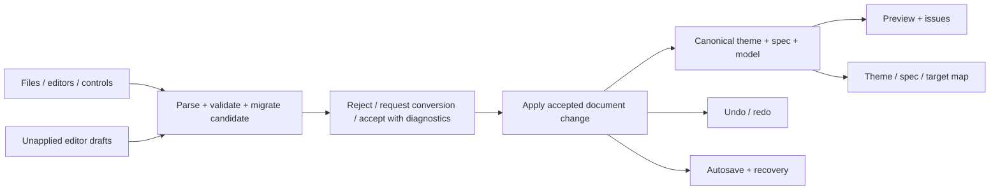

# Product direction and architecture

Status: lead-approved direction, 2026-09-08. Sprint 001 is the only currently approved implementation scope. Later work below is a roadmap, not permission to build everything now.

## What the product is for

Theme Forge helps a report designer move from a visual design idea to a consistent Power BI theme and a structured report specification. Users need to know both what the design means and which settings a downstream tool can actually reproduce.

The intended complete workflow:
1. Start from a style family or import existing design/model metadata.
2. Design pages, visuals, bindings, filters, bookmarks and accessibility descriptions.
3. Preview the design with clearly identified sample data and visual substitutions.
4. See problems and unsupported export behavior before relying on the files.
5. Export the theme, dashboard spec and target diagnostics; reopen and continue safely.
6. Pass the design intent to a separately verified PbiBench integration.

Success means consistent report intent, no silent destructive conversion, reliable recovery, and exports whose supported behavior is backed by evidence. More visual types or an AI chat panel are lower priorities until those foundations hold.

## Starting implementation (before Sprint 001)

`theme-forge.html` is a roughly 537 KB HTML/CSS/vanilla-JavaScript application. Runtime has no backend or build step. `index.html` is a static entry point; `netlify.toml` currently publishes the repository root.

Core state is held in globals: `S` (theme controls), `SPEC` (report intent), `MODEL` (metadata), plus derived `PAGES`, selections and workspace variables. Rendering, history scheduling and autosave are coupled: `renderJson()` calls `noteHistory()` and `saveSession()`. Imports enter via multiple functions and do not yet share one complete application policy.

Existing local contracts declare dashboard-spec 3, model metadata 1, and theme schema string 2.156. These are observed repository targets, not a statement of the latest Microsoft versions or certified schema compliance.

The product already includes 27 intent kinds, 11 style families, 35 variants, formatting, interactions and accessibility tooling. The backlog should improve their reliability and usefulness before duplicating existing capabilities.

The S001 candidate introduces shared preparation/application and recovery retention, but is not yet accepted. See [lead review](reviews/SPRINT-001-lead.md) for the implemented architecture assessment and required repairs.

## Target responsibilities

| Responsibility | Owns | Depends on |
| --- | --- | --- |
| Domain contracts | Shapes, typed values, supported versions, limits, immutable migration, diagnostic policy | Plain data only |
| Theme domain | Control values, preserved imported theme, mapping from controls to theme paths, normalization/conversion evidence | Contracts and stable registries |
| Report/model domain | Pages, visuals, bindings, identity/reference checks, supported model metadata | Contracts and registries |
| Document application | Prepare a candidate, apply one accepted change, update document revision, history and persistence | Domain + injected browser adapters |
| Editor drafts | Raw text, source kind, base revision, pending/invalid/applied state | Application; no implicit state replacement |
| History | Accepted document transitions and redo invalidation | Canonical document snapshots or immutable references |
| Storage adapter | Session serialization/version, write status, recovery candidate and lifecycle flush | Contracts/application; browser storage |
| Export adapters | Theme, spec, target-map data and explicit diagnostics | Canonical document + registries |
| Preview/rendering | Canvas and approximate data rendering, selection, panels, accessibility UI | Read-only derived document view |
| UI adapters | DOM input, file/drop/clipboard/download events and status presentation | Application + browser APIs |
| Test tooling | Pure contract fixtures, browser outcomes, export/schema and downstream evidence | Public seams; no production dependency |

Dependency direction: UI → application → domain. Preview/export consume the same accepted document and registries. Browser storage/download/DOM are adapters, not domain dependencies.



This is a logical architecture first. Sprint 001 can introduce clear functions inside the existing script. A later source split must preserve direct `file://` launch and static hosting. Browser ES modules loaded directly from local files are not assumed to work. ADR-006 below resolves that packaging tradeoff explicitly.

## Invariants to design and audit against

- INV-01: Rejection leaves theme, spec, model, selection, comparison, history and saved accepted state unchanged. An invalid draft and its diagnostic may change.
- INV-02: Result status explicitly states whether a candidate was applied. Content diagnostics are separate from that fact.
- INV-03: Every import route uses the same version, size, structural, migration and normalization policy for its document type.
- INV-04: Imported input is never mutated by validation/migration. Derived preparation completes before accepted state replacement. Unexpected application failure cannot leave half-restored state.
- INV-05: Exports preserve supported semantic intent. Any conversion that drops or changes supplied content is visible before the user accepts it. Future lossless import must preserve unedited input properties.
- INV-06: Theme, report and model restored by undo/recovery are mutually consistent. Navigation, selection and Detail 1/2/3 cannot alter exported intent.
- INV-07: Draft text and accepted document state are different things. Timer, focus, tab or panel changes must not silently commit an obsolete draft or discard invalid text.
- INV-08: Persistence reports failure truthfully and does not overwrite a recoverable original session merely because boot validation failed.
- INV-09: The preview never changes intent kind to its stand-in, claims to execute a real model query, or promises Power BI rendering fidelity without evidence.
- INV-10: Imported strings/keys remain data. Use context-safe DOM/text/URL handling and own-property dictionary lookups; arbitrary property names must not corrupt registries/prototypes.
- INV-11: Validation/export diagnostics describe the document being exported, not a stale cached validation result.
- INV-12: A test report identifies the candidate it actually exercised. Unrun checks are not passes.

## Decisions

### ADR-001 — Preserve the product boundary

Keep a static browser workbench with browser-local persistence and JSON artifacts. No Fabric authentication, credentials, backend database, PBIR writer or model-query engine is in current scope. PbiBench owns materialization; its interface must be verified before promising integration.

Why: users already have a working portable design tool. Adding infrastructure does not solve the confirmed correctness gaps.

### ADR-002 — Candidate preparation before application

Introduce shared preparation per document type returning a typed result, for example:

```js
// Preparation: no global mutations and no rendering.
{ status: 'rejected' | 'needs-conversion' | 'ready',
  candidate, issues, changes }
// Application result separates acceptance from document issues.
{ applied: true | false, issues, changes }
```

Use structured issue codes/paths and a blocking classification; do not infer blocking behavior from a display string such as `where === 'spec'`. Compatibility wrappers may remain, but their flags and caller behavior must be unambiguous.

Reject syntax/shape violations, invalid identity types, duplicate IDs, invalid numeric geometry, unsupported contract versions, exceeded limits and unsafe structures. Supported v1/v2/missing-version specs migrate to v3 through a tested path. Explicit versions must be integers in the supported range; strings and future versions are rejected.

Lead clarification after S001 review: a bookmark's display name is content, not its stable ID. An empty string is safe incomplete display content with a diagnostic/fallback label; non-string names and invalid/empty IDs still reject. Model/table/field identifiers remain nonempty strings.

Accept safe but incomplete report intent with visible diagnostics: missing model fields, dangling action references and unknown visual kinds can remain editable if handled safely and preserved. Exports must retain diagnostics. Missing legacy IDs can be generated deterministically and uniquely, identically across import routes, with an explicit migration note. Do not silently guess unknown kind semantics.

Validate expected properties at known contract paths. Unknown extension properties are inert data; they do not acquire array/object requirements just because a key is called `filters`. Unknown data still counts toward byte/depth limits and conversion reporting.

### ADR-003 — Honest theme conversion now, lossless preservation next

Sprint 001 retains the current supported-controls theme conversion, existing named-preset preservation and current eight-color control model. Before applying a theme that changes/drops supplied content, show a concrete conversion report and an explicit "Import supported settings" action; cancel keeps the active document unchanged. A changed/discarded path, palette truncation or normalized value cannot be hidden behind "applied."

Compare supplied properties against the generated candidate output using semantic JSON comparison: ignore key order, do not flag newly generated defaults as lost input. Preserve string values exactly. Report malformed structural values as rejected, not converted. Changes made by normalization count as conversions. Do not claim Microsoft-schema validation from these local shape checks.

Sprint 002 should add an imported source document plus explicit ownership of editable theme paths. Unedited properties and full palettes survive export; changed controls overlay only their documented owned paths. Arrays require explicit replacement semantics, not a generic deep merge. Imported named presets win collisions until intentionally edited/reset; preview limitations must be visible.

Why this order: the immediate reliability sprint makes current behavior honest without mixing a complete theme-data redesign into transaction fixes.

### ADR-004 — Separate document, draft and workspace state

Canonical document: theme controls plus imported/preservation metadata, spec, model. Workspace: active page/panels, zoom, detail, selection. Drafts: per-editor raw text and base document revision.

Accepted document changes create history/save events; rerendering alone should not. Coalesce gestures/text changes deliberately, but flush pending accepted edits before undo. A new accepted edit after undo clears redo. Model replacement belongs to document history so undo cannot restore a spec against the wrong model.

An unapplied draft based on an older accepted document revision needs an explicit conflict/reapply path. Never let a stale debounce overwrite newer imported or restored state.

Lead clarification after S001 review: mutation handlers must explicitly notify document history/save/revision logic. Redrawing a filter or bookmark panel alone is insufficient. Audit handler coverage; do not rely on periodic polling or test helpers that force a snapshot. Existing page-hide storage remains an array of page-name strings until a separately designed migration changes it.

Draft persistence across browser restarts is deferred. The UI must explain that autosave covers accepted changes, not imply invalid/pending drafts are saved.

### ADR-005 — Safe recovery and storage compatibility

Validate a cloned recovery candidate before mutation. Keep the current session key compatible where possible; if the envelope changes, introduce an explicit storage version and migration fixture. Corrupt/unsupported saved content must remain available for recovery/export rather than being deleted or immediately replaced by the default sample.

Suspend writes over an invalid original session until the user chooses recovery/reset or starts a deliberate replacement. Browser storage is best effort; lifecycle flushing helps but does not guarantee recovery after process termination. No cloud-sync promise.

### ADR-006 — Modularization after contract tests

Do not rewrite in React. First separate pure logic and explicit state transitions inside the current source. After reliability/fidelity gates, move source into focused modules and keep a generated self-contained HTML distribution as the portable artifact, with deterministic generation and a freshness check.

This deliberately adds a development generation step later, while users still need no runtime build/server. Avoid manually maintained duplicate implementations. Before changing generation or publish layout, the lead specifies the packaging sprint and verifies hosting requirements. Reconsider publishing the whole repo so management reports/test artifacts do not become public site assets.

### ADR-007 — Evidence before compatibility claims

Local browser tests prove Theme Forge behavior. A declared schema string does not prove a valid Power BI theme. Add pinned official-schema fixtures and representative Power BI Desktop tests in a later explicit compatibility sprint. Record schema source/version/checksum and Desktop version.

Do not invent a downstream contract or claim a successful PbiBench round trip without the downstream source or a real fixture/result.
